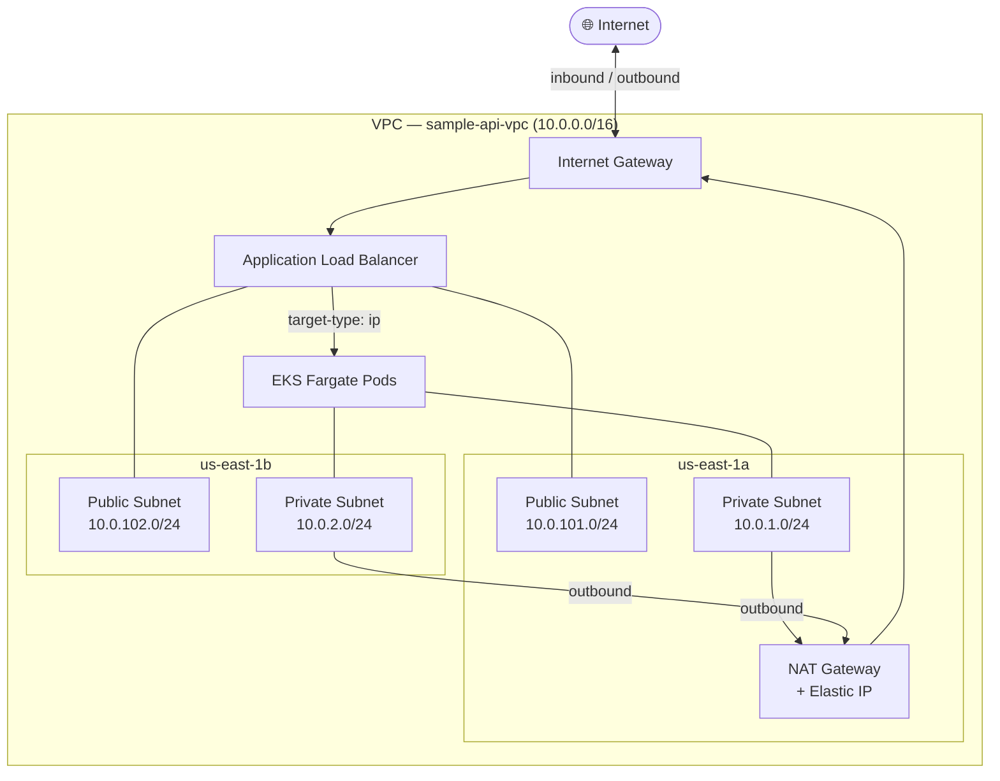
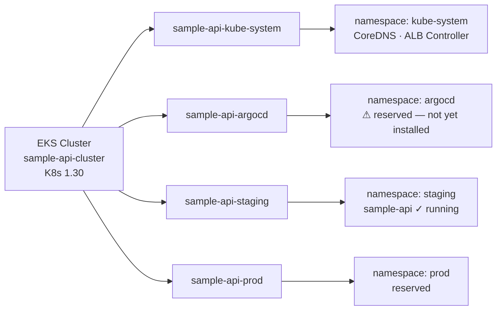
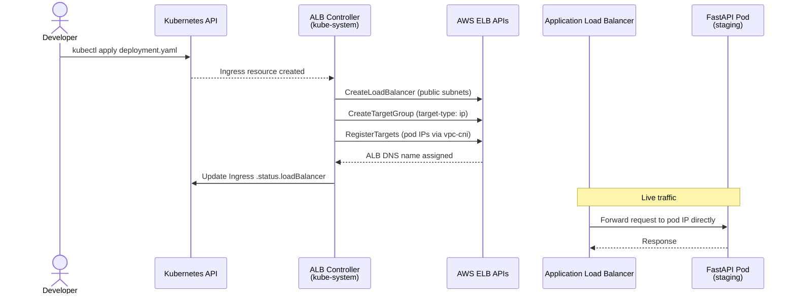
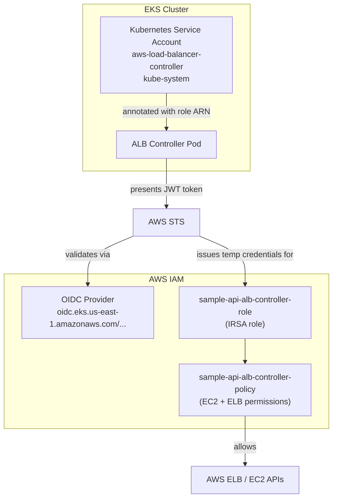

# Architecture

This page describes what exists in production: every AWS resource, why it was chosen, and how the components relate to each other. Infrastructure IAM — the roles and policies the infrastructure itself requires to function — is covered at the end.

---

## Container Registry — ECR

Amazon Elastic Container Registry (ECR) stores the Docker images that the cluster runs. It is the only AWS resource that stays permanently provisioned regardless of whether the cluster is running.

**Repository:** `sample-api-ecr`
**Region:** `us-east-1`
**URL:** `065571033838.dkr.ecr.us-east-1.amazonaws.com/sample-api-ecr`

### Configuration

| Setting | Value | Reason |
|---|---|---|
| Tag mutability | `MUTABLE` | Allows overwriting tags like `latest` during development |
| Scan on push | Enabled | Free basic vulnerability scan on every image push |
| Lifecycle policy | Keep last 5 images | Auto-expires old images, controls storage cost |

### Image Tags in Use

| Tag | Status | Notes |
|---|---|---|
| `manual-test` | Superseded | First test push, old Dockerfile with errors |
| `v1` | Superseded | Missing `CMD` instruction, pods crashed immediately |
| `v2` | Current | Working image, deployed to staging |

---

## Networking — VPC

All compute runs inside a dedicated VPC. The network is split across two Availability Zones for resilience and into public and private tiers for security.

**VPC Name:** `sample-api-vpc`
**CIDR:** `10.0.0.0/16`
**Region:** `us-east-1`
**AZs:** `us-east-1a`, `us-east-1b`

### Network Topology



### Subnet Layout

| Subnet | CIDR | AZ | Purpose |
|---|---|---|---|
| Private | `10.0.1.0/24` | us-east-1a | EKS Fargate pods |
| Private | `10.0.2.0/24` | us-east-1b | EKS Fargate pods |
| Public | `10.0.101.0/24` | us-east-1a | ALB |
| Public | `10.0.102.0/24` | us-east-1b | ALB |

### Gateways and Routing

| Component | Detail |
|---|---|
| Internet Gateway | Attached to VPC — inbound traffic reaches the ALB |
| NAT Gateway | Single, in `us-east-1a` — outbound traffic from pods (image pulls, API calls) |
| Elastic IP | Attached to NAT Gateway |

### Design Decisions

**Single NAT Gateway:** Two NAT Gateways (one per AZ) would provide full AZ isolation for outbound traffic but cost ~$64/mo vs ~$32/mo. For a proof-of-concept with no SLA requirement, a single NAT is acceptable. If `us-east-1a` goes down, pods in `us-east-1b` lose outbound connectivity — a known and accepted trade-off.

**Two AZs:** Private and public subnets exist in both AZs. Fargate will spread pods across AZs. The ALB requires subnets in at least two AZs to provision. Subnets themselves cost nothing.

### Required Subnet Tags

EKS and the ALB Controller use subnet tags to discover which subnets to use for load balancers. Without these tags the ALB will not provision.

```
Private subnets: kubernetes.io/role/internal-elb = 1
Public subnets:  kubernetes.io/role/elb = 1
```

---

## Compute — EKS + Fargate

**Cluster name:** `sample-api-cluster`
**Kubernetes version:** `1.30`
**Compute type:** Fargate only — no EC2 node groups

### Why Fargate

Fargate eliminates node management entirely. There are no EC2 instances to patch, no node groups to scale, and no idle capacity to pay for. Each pod runs in its own isolated microVM. The trade-off is less flexibility (no DaemonSets, no `hostNetwork`, no privileged containers) — none of which are needed here.

### Fargate Profiles

A Fargate profile tells EKS which namespaces are eligible to run on Fargate. Pods in a namespace without a matching profile will remain `Pending` indefinitely.



| Profile | Namespace | Purpose |
|---|---|---|
| `sample-api-kube-system` | `kube-system` | CoreDNS, AWS Load Balancer Controller |
| `sample-api-argocd` | `argocd` | Reserved — ArgoCD will be installed here in a later phase |
| `sample-api-staging` | `staging` | Current application deployment |
| `sample-api-prod` | `prod` | Reserved for production workloads |

### Cluster Add-ons

| Add-on | Version | Purpose |
|---|---|---|
| CoreDNS | latest | In-cluster DNS — required for service discovery |
| kube-proxy | latest | Network rules on each Fargate node |
| vpc-cni | latest | Assigns VPC IPs directly to pods (required for ALB target-type `ip`) |

CoreDNS is explicitly configured with `computeType: Fargate` to ensure it schedules onto Fargate nodes rather than waiting for EC2 nodes that will never arrive.

### Cluster Endpoint

The cluster API endpoint is public, allowing `kubectl` access from a developer laptop. Access is controlled by the EKS access entry below — public endpoint exposure without an access entry grants no permissions.

### CloudWatch Logging

A log group `/aws/eks/sample-api-cluster/cluster` captures control plane logs. Cost is minimal (~$0.50/mo).

---

## Ingress — AWS Load Balancer Controller + ALB

The AWS Load Balancer Controller (ALB Controller) runs in the `kube-system` namespace and watches for `Ingress` resources. When an `Ingress` is created with the correct annotations, the controller provisions an Application Load Balancer in the public subnets automatically.

**Controller version:** `v2.11.0`
**Installed via:** Helm

### How It Works



### Ingress Annotations

The following annotations on the `Ingress` resource control ALB provisioning:

| Annotation | Value | Effect |
|---|---|---|
| `kubernetes.io/ingress.class` | `alb` | Selects the ALB controller |
| `alb.ingress.kubernetes.io/scheme` | `internet-facing` | ALB in public subnets, reachable from internet |
| `alb.ingress.kubernetes.io/target-type` | `ip` | Routes directly to pod IPs via vpc-cni |
| `alb.ingress.kubernetes.io/healthcheck-path` | `/health` | ALB health check path |

### Fargate-Specific Requirement

On EC2 nodes, the ALB Controller reads the VPC ID from EC2 instance metadata. Fargate pods have no instance metadata endpoint. The VPC ID must be passed explicitly at Helm install time via `--set vpcId=<vpc-id>`. The Terraform module handles this by reading the VPC ID from the VPC remote state.

---

## Infrastructure IAM

These are the IAM resources the infrastructure itself requires to function — not the operator IAM used to build it (that is covered in [Tooling & IAM](tooling.md)).

### Infrastructure IAM Overview



### OIDC Provider

EKS creates an OpenID Connect (OIDC) provider for the cluster. This is the foundation of IAM Roles for Service Accounts (IRSA) — it allows Kubernetes service accounts to assume IAM roles without static credentials.

**Provider URL:** `oidc.eks.us-east-1.amazonaws.com/id/741CB034A92C1753A1BE5756960AAE60`

### IRSA — ALB Controller Role

The ALB Controller pod needs to call AWS APIs (EC2, ELB) to provision load balancers. Rather than embedding credentials, IRSA is used: the pod's Kubernetes service account is annotated with an IAM role ARN, and the OIDC provider validates the pod's identity token at the STS level.

**Role:** `sample-api-alb-controller-role`
**Policy:** `sample-api-alb-controller-policy` (official AWS LBC policy v2.11.0 + two additional actions)
**Trusted service account:** `system:serviceaccount:kube-system:aws-load-balancer-controller`

The trust policy restricts assumption to exactly one service account in exactly one namespace:

```json
{
  "Condition": {
    "StringEquals": {
      "<oidc-provider>:aud": "sts.amazonaws.com",
      "<oidc-provider>:sub": "system:serviceaccount:kube-system:aws-load-balancer-controller"
    }
  }
}
```

Two actions were missing from the official policy and added manually after hitting permission errors during deployment:

| Action | Reason |
|---|---|
| `ec2:GetSecurityGroupsForVpc` | Required by controller v2.11.0 to enumerate VPC security groups |
| `elasticloadbalancing:DescribeListenerAttributes` | Required to reconcile existing listener state |

### Fargate Execution Roles

Each Fargate profile has an associated IAM role that the Fargate infrastructure assumes to pull container images from ECR and write logs to CloudWatch. These roles are auto-created by the EKS Terraform module — one per profile.

### EKS Access Entry

By default, the IAM role used to create an EKS cluster has no automatic `kubectl` access in newer API versions. An explicit access entry is required:

```hcl
access_entries = {
  terraform_executor = {
    principal_arn = "arn:aws:iam::065571033838:role/sample-api-terraform-executor-role"
    policy_associations = {
      admin = {
        policy_arn   = "arn:aws:eks::aws:cluster-access-policy/AmazonEKSClusterAdminPolicy"
        access_scope = { type = "cluster" }
      }
    }
  }
}
```

This grants `AmazonEKSClusterAdminPolicy` to the Terraform executor role — the same identity used to run `kubectl` commands during deployment. Without this, `kubectl get nodes` returns a credentials error even with valid AWS credentials.
