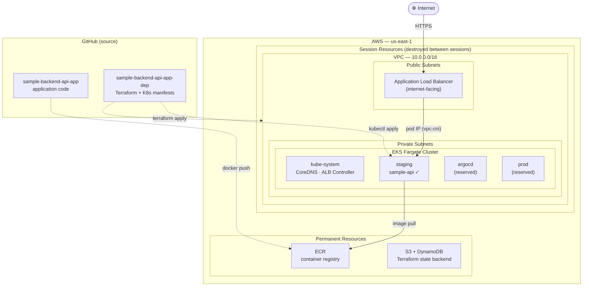

# Baseline Prod Infrastructure

This section documents the production deployment of a sample FastAPI application on AWS, built using standard tooling — Terraform for infrastructure, Helm for cluster add-ons, and `kubectl` for application manifests. No automation layer is involved.

It exists as the **baseline** for the dissertation. Before introducing the CNOE platform, Gitea Actions pipelines, and the agentic layer, it is necessary to have a concrete, working reference point: a real application running in a real production environment, deployed and verified by hand. The systems built in later phases are designed to observe, govern, and automate deployments to this exact infrastructure.

## What This Section Is Not

This section does not cover how deployments are automated, how images are built in CI, or how GitOps manages state. Those concerns belong to the Platform Engineering section. This section covers the infrastructure those systems will eventually target.

## Production Stack

## What Each Page Covers

| Page | Content |
|---|---|
| [Architecture](architecture.md) | What exists: EKS, Fargate, ECR, VPC, ALB, and the IAM the infrastructure requires to function |
| [Tooling & IAM](tooling.md) | How it is managed: Terraform module structure, operator IAM hierarchy, AWS profile configuration |
| [Deployment Procedure](procedure/index.md) | Step-by-step guide to replicate the full setup from scratch |
| [Repositories](repositories.md) | App repo and deployment repo — structure, purpose, and what lives where |

## Cost Model

Resources are split into two groups: **permanent** (always running) and **session** (destroyed at end of each working session to avoid idle cost).

### Permanent

| Resource | Monthly |
|---|---|
| ECR storage (~5 images) | ~$0.01 |
| S3 state bucket | ~$0.00 |
| DynamoDB lock table | ~$0.07 |
| **Total** | **< $0.10/mo** |

### Session (active when working)

| Resource | Hourly | Daily | Monthly (est.) |
|---|---|---|---|
| EKS control plane | $0.10 | $2.40 | ~$73 |
| NAT Gateway | $0.045 | $1.08 | ~$32 |
| ALB | $0.022 | $0.53 | ~$16 |
| Fargate pods | ~$0.01 | ~$0.24 | ~$7 |
| CloudWatch Logs | — | minimal | ~$0.50 |
| **Total** | **~$0.18/hr** | **~$4.25/day** | **~$128/mo** |

In practice, the session infrastructure is brought up for a few hours at a time and destroyed immediately after. The actual monthly spend is negligible.
