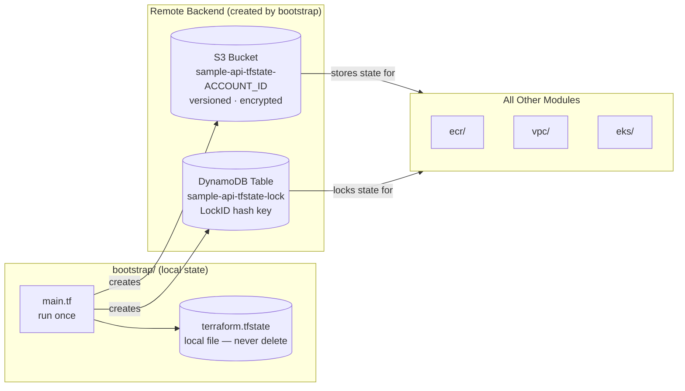

# Step 2 — State Backend

**Run once. Never destroy these resources.**

Creates the S3 bucket and DynamoDB table that all subsequent Terraform modules use for remote state and locking.

---

## Why Bootstrap Uses Local State

The bootstrap module creates the resources that remote state depends on. Remote state cannot exist before those resources are created — a chicken-and-egg problem.


The bootstrap module is the only one that runs with local state. All other modules use the S3 backend created here.

The local state file (`bootstrap/terraform.tfstate`) tracks exactly two resources and never changes after the initial apply. Keep it on disk. If it is lost, both resources can be reimported:

```bash
terraform import aws_s3_bucket.tfstate sample-api-tfstate-ACCOUNT_ID
terraform import aws_dynamodb_table.tflock sample-api-tfstate-lock
```

---

## Apply

```bash
export AWS_PROFILE=sample-api-terraform

cd sample-backend-api-app-dep/bootstrap
terraform init
terraform apply -var="account_id=YOUR_ACCOUNT_ID"
```

Terraform will create:

| Resource | Name |
|---|---|
| S3 Bucket | `sample-api-tfstate-ACCOUNT_ID` |
| DynamoDB Table | `sample-api-tfstate-lock` |

---

## S3 Bucket Configuration

| Setting | Value |
|---|---|
| Versioning | Enabled — full history of every state file change |
| Encryption | AES256 server-side encryption |
| Public access | Fully blocked |
| `prevent_destroy` | Set — Terraform cannot delete this bucket accidentally |

The `prevent_destroy` lifecycle rule means `terraform destroy` in the bootstrap directory will fail with an error. Deleting the bucket requires removing the lifecycle rule first, then running destroy — a deliberate two-step process that prevents accidents.

---

## DynamoDB Table Configuration

| Setting | Value |
|---|---|
| Table name | `sample-api-tfstate-lock` |
| Hash key | `LockID` |
| Billing | `PAY_PER_REQUEST` — no idle cost |

When Terraform starts an `apply`, it writes a lock record to this table. Any concurrent `apply` against the same state key will read the lock and abort, preventing two operators from modifying state simultaneously.

---

## Verification

```bash
aws s3 ls | grep sample-api-tfstate
# sample-api-tfstate-065571033838

aws dynamodb list-tables --query "TableNames" --output table
# sample-api-tfstate-lock
```

---

## Cost

| Resource | Monthly |
|---|---|
| S3 storage (state files) | ~$0.00 |
| DynamoDB operations | ~$0.07 |
| **Total** | **< $0.10/mo** |
