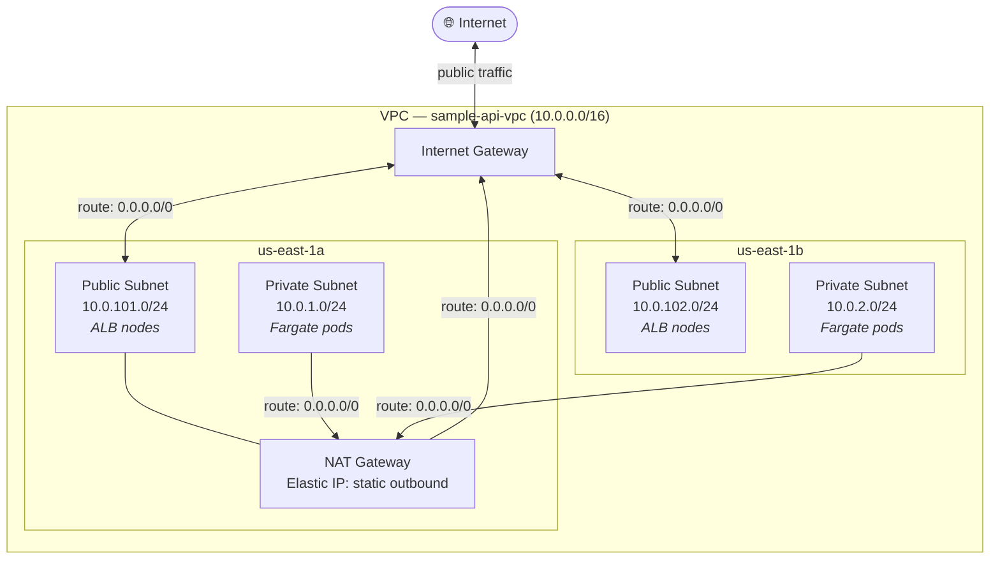

# Step 4 — Networking

**Session resource — destroy at end of each session.**

Creates the VPC, subnets, NAT Gateway, Internet Gateway, and route tables. EKS depends on this module and reads its outputs from remote state.

---

## Apply

```bash
export AWS_PROFILE=sample-api-terraform

cd sample-backend-api-app-dep/vpc
terraform init
terraform apply
```

Outputs (values change on each recreate — never hardcode these):

```
vpc_id             = "vpc-081c0bb37c1322e40"
private_subnet_ids = ["subnet-044ffee5fd9054200", "subnet-01f465b780a1d1873"]
public_subnet_ids  = ["subnet-0e246eb20070f71d3", "subnet-0876ac3961fca7d60"]
```

The EKS module reads these via `data "terraform_remote_state"` — no manual copying needed.

---

## What Gets Created



19 resources in total:

| Resource | Detail |
|---|---|
| VPC | `sample-api-vpc` — `10.0.0.0/16` |
| Private subnet | `10.0.1.0/24` — us-east-1a |
| Private subnet | `10.0.2.0/24` — us-east-1b |
| Public subnet | `10.0.101.0/24` — us-east-1a |
| Public subnet | `10.0.102.0/24` — us-east-1b |
| Internet Gateway | Attached to VPC |
| Elastic IP | For NAT Gateway |
| NAT Gateway | Single, in us-east-1a public subnet |
| Route tables | Public (via IGW) + private (via NAT) |
| Subnet associations | Route tables associated with each subnet |

---

## Verify

```bash
aws ec2 describe-vpcs \
  --filters "Name=tag:Name,Values=sample-api-vpc" \
  --query 'Vpcs[*].{ID:VpcId,CIDR:CidrBlock,State:State}' \
  --output table \
  --profile sample-api-terraform
```

---

## Destroy

```bash
cd sample-backend-api-app-dep/vpc
terraform destroy
```

!!! warning
    Always destroy EKS before destroying VPC. If EKS (and its ALB) is still running when you destroy the VPC, Terraform will fail because AWS will not delete a VPC that contains active load balancers or ENIs.

---

## Cost

| Resource | Hourly | Daily | Monthly |
|---|---|---|---|
| NAT Gateway | $0.045 | ~$1.08 | ~$32 |
| Everything else | free | free | free |
