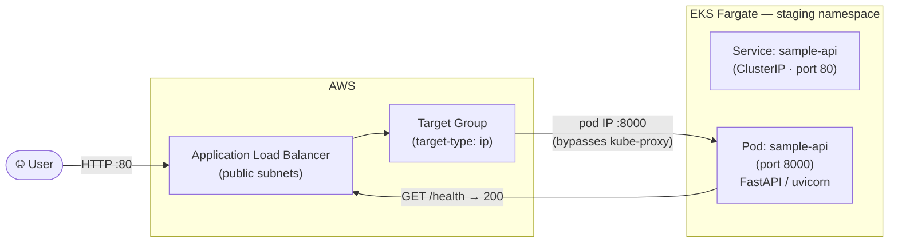

# Step 7 — Application Deployment

Deploys the FastAPI application to the `staging` namespace using a single Kubernetes manifest. The manifest creates the namespace, deployment, service, and ingress in one apply.

The manifest is located at: `sample-backend-api-app-dep/sample-api-infra/k8s-manual-test/deployment.yaml`

!!! note "Current State"
    This manifest is a manual test deployment — the directory name reflects that. It is the baseline for verifying the infrastructure works end to end. In a later phase this will be replaced by Kustomize overlays managed via GitOps.

---

## Deploy

```bash
kubectl apply -f sample-backend-api-app-dep/sample-api-infra/k8s-manual-test/deployment.yaml
```

This creates:

| Resource | Namespace | Detail |
|---|---|---|
| Namespace | — | `staging` |
| Deployment | `staging` | `sample-api`, 1 replica, image `sample-api-ecr:v2` |
| Service | `staging` | `sample-api`, ClusterIP, port 80 → 8000 |
| Ingress | `staging` | `sample-api`, triggers ALB provisioning |

---

## Request Flow

Once deployed, inbound requests travel through the following path:



## Wait for ALB Provisioning

After applying the manifest, the ALB Controller detects the `Ingress` resource and provisions an ALB. This takes 1–3 minutes.

```bash
# Watch until ADDRESS is populated
kubectl get ingress -n staging --watch
# NAME         CLASS    HOSTS   ADDRESS                                                           PORTS
# sample-api   <none>   *       k8s-staging-sampleap-3a9034c3f5-439640156.us-east-1.elb.amazonaws.com   80
```

---

## Verify Pod

```bash
kubectl get pods -n staging
# NAME                          READY   STATUS    RESTARTS   AGE
# sample-api-5dc54d68fc-wlffq   1/1     Running   0          2m

kubectl logs -n staging deployment/sample-api
# INFO:     Started server process
# INFO:     Waiting for application startup.
# INFO:     Application startup complete.
# INFO:     Uvicorn running on http://0.0.0.0:8000
```

---

## Verify App

```bash
ALB_URL=$(kubectl get ingress sample-api -n staging \
  -o jsonpath='{.status.loadBalancer.ingress[0].hostname}')

# Health check
curl http://${ALB_URL}/health
# {"status":"ok"}

# Root route
curl http://${ALB_URL}/
# {"hello":"world"}
```

---

## Application Configuration

The manifest sets one environment variable:

| Variable | Value | Notes |
|---|---|---|
| `SECRET_KEY` | `topsecretkey` | Hardcoded in manifest — will move to AWS Secrets Manager in a later phase |

Resource limits are set to prevent a single pod from consuming excessive Fargate capacity:

| Setting | Request | Limit |
|---|---|---|
| CPU | 250m | 500m |
| Memory | 256Mi | 512Mi |

Health probes prevent the ALB from routing traffic to pods that are not ready:

| Probe | Path | Initial Delay | Period |
|---|---|---|---|
| Readiness | `/health` | 10s | 10s |
| Liveness | `/health` | 15s | 30s |

---

## Cleanup (End of Session)

Delete the Kubernetes resources before destroying EKS. This triggers the ALB Controller to delete the ALB. Skipping this step leaves an orphaned ALB that blocks VPC deletion.

```bash
# Delete all resources in the manifest
kubectl delete -f sample-backend-api-app-dep/sample-api-infra/k8s-manual-test/deployment.yaml

# Wait for the ALB to be fully deleted before proceeding
kubectl get ingress -n staging
# Wait until this returns "No resources found" or ADDRESS is empty
```

After the ALB is gone, proceed to destroy EKS and then VPC as described in the [session management guide](index.md).
