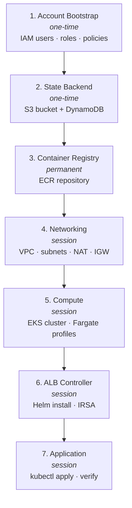
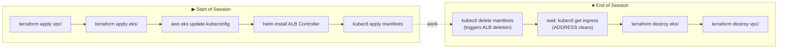

# Deployment Procedure

This section provides a step-by-step guide to replicating the full baseline production infrastructure from scratch. Each page corresponds to one Terraform module or deployment stage, applied in order.

## Prerequisites

The following tools must be installed before starting:

| Tool | Version | Purpose |
|---|---|---|
| Terraform | >= 1.0 | Infrastructure provisioning |
| AWS CLI | v2 | AWS authentication and verification |
| kubectl | >= 1.28 | Kubernetes cluster interaction |
| Helm | >= 3.0 | ALB Controller installation |
| Docker | >= 24 | Building and pushing container images |

### AWS CLI Configuration

Configure two local profiles before running any Terraform:

```ini
# ~/.aws/config
[profile sample-api-cli]
region = us-east-1

[profile sample-api-terraform]
role_arn       = arn:aws:iam::ACCOUNT_ID:role/sample-api-terraform-executor-role
source_profile = sample-api-cli
region         = us-east-1
```

```ini
# ~/.aws/credentials
[sample-api-cli]
aws_access_key_id     = <access-key-for-sample-api-cli-user>
aws_secret_access_key = <secret-key-for-sample-api-cli-user>
```

Verify both profiles work:

```bash
# Verify CLI user credentials
aws sts get-caller-identity --profile sample-api-cli

# Verify role assumption works
aws sts get-caller-identity --profile sample-api-terraform
# Expected: "Arn": "arn:aws:sts::ACCOUNT_ID:assumed-role/sample-api-terraform-executor-role/..."
```

---

## Deployment Order

Steps 1 and 2 are one-time setup. Steps 3–7 make up a full session.



---

## Session Management

EKS and VPC are expensive to leave running (~$4/day combined). Destroy them at the end of every working session and recreate them at the start of the next.



ECR and the state backend are permanent — never destroy them.

### Start of Session

```bash
export AWS_PROFILE=sample-api-terraform

# 1. Bring up networking
cd sample-backend-api-app-dep/vpc
terraform apply

# 2. Bring up compute
cd ../eks
terraform apply

# 3. Configure kubectl
aws eks update-kubeconfig \
  --name sample-api-cluster \
  --region us-east-1 \
  --profile sample-api-terraform
```

### End of Session

The ALB must be deleted before EKS and VPC are destroyed. If EKS is destroyed while an ALB is still attached to the VPC, the VPC destroy will fail because AWS will not delete a VPC with a load balancer still in it.

```bash
# 1. Delete Kubernetes resources (triggers ALB deletion by the controller)
kubectl delete -f sample-backend-api-app-dep/sample-api-infra/k8s-manual-test/deployment.yaml

# 2. Wait for ALB to be fully deleted before proceeding
kubectl get ingress -n staging
# Wait until ADDRESS column is empty

# 3. Destroy EKS (always before VPC)
cd sample-backend-api-app-dep/eks
terraform destroy

# 4. Destroy VPC
cd ../vpc
terraform destroy
```

!!! warning "Destroy Order is Mandatory"
    Always destroy in this order: app resources → EKS → VPC. Destroying VPC before EKS leaves orphaned Fargate resources. Destroying EKS while an ALB is running leaves an orphaned load balancer that blocks VPC deletion.
