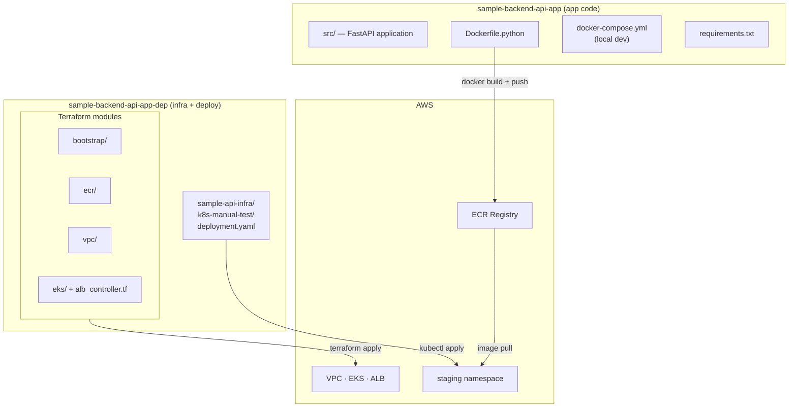

# Repositories

The baseline deployment uses two GitHub repositories. They are intentionally separated: one owns the application, the other owns the infrastructure and deployment configuration. This separation means infrastructure changes and application changes have independent Git histories and can be reviewed independently.



---

## sample-backend-api-app

**URL:** [https://github.com/VedantPatil1/sample-backend-api-app](https://github.com/VedantPatil1/sample-backend-api-app)
**Purpose:** Application source code

### Structure

```
sample-backend-api-app/
├── Dockerfile.python         ← Production container image definition
├── docker-compose.yml        ← Local development environment
├── requirements.txt          ← Production Python dependencies
├── requirements.dev.txt      ← Development-only dependencies
└── src/
    ├── main.py               ← Application entrypoint (FastAPI instance)
    └── app/
        ├── __init__.py       ← Application factory (create_app)
        └── config.py         ← Settings via pydantic-settings
```

### Application

The app is a minimal FastAPI service used as a concrete artifact for testing the infrastructure end to end. It exposes two routes:

| Route | Response |
|---|---|
| `GET /` | `{"hello": "world"}` |
| `GET /health` | `{"status": "ok"}` |

The `/health` route is used by both the ALB health check and Kubernetes liveness/readiness probes.

### Dockerfile

The production image is built from `Dockerfile.python`. Key decisions:

| Decision | Detail |
|---|---|
| `FROM --platform=linux/amd64` | Ensures correct architecture for EKS Fargate even when building on Apple Silicon |
| `python:3.12-slim` | Minimal base image, reduces attack surface and image size |
| Isolated venv at `/py` | Keeps Python dependencies separate from system packages |
| Non-root user `app-user` | Container does not run as root |
| No `HEALTHCHECK` in Dockerfile | Health checking is handled by Kubernetes probes, not Docker |

### Local Development

```bash
# Start with hot reload
docker compose up

# App available at http://localhost:8000
```

`docker-compose.yml` mounts `./src` as a volume and runs uvicorn with the default `--reload` flag, enabling hot reload during development. `DEV=true` installs development dependencies from `requirements.dev.txt`.

### Dependencies

All dependencies are pinned to minor version ranges:

```
fastapi>=0.129.0,<0.130
uvicorn>=0.41.0,<0.42
pydantic-settings>=2.13.1,<2.14
```

Minor version pins allow patch updates (security fixes) while preventing breaking changes from minor version bumps.

---

## sample-backend-api-app-dep

**URL:** [https://github.com/VedantPatil1/sample-backend-api-app-dep](https://github.com/VedantPatil1/sample-backend-api-app-dep)
**Purpose:** Infrastructure (Terraform) and Kubernetes deployment manifests

### Structure

```
sample-backend-api-app-dep/
├── bootstrap/
│   ├── main.tf               ← S3 bucket + DynamoDB table (local state, run once)
│   └── terraform.tfstate     ← Local state file — do not delete
├── ecr/
│   └── main.tf               ← ECR repository + lifecycle policy
├── vpc/
│   └── main.tf               ← VPC, subnets, NAT, IGW, route tables
├── eks/
│   ├── main.tf               ← EKS cluster, Fargate profiles, addons, access entry
│   └── alb_controller.tf     ← ALB controller IAM role + policy
└── sample-api-infra/
    └── k8s-manual-test/
        └── deployment.yaml   ← Namespace + Deployment + Service + Ingress
```

### Terraform Modules

| Module | State | Lifecycle | Depends On |
|---|---|---|---|
| `bootstrap/` | Local | Permanent | Nothing |
| `ecr/` | Remote (`ecr/terraform.tfstate`) | Permanent | bootstrap |
| `vpc/` | Remote (`vpc/terraform.tfstate`) | Session | bootstrap |
| `eks/` | Remote (`eks/terraform.tfstate`) | Session | vpc (remote state) |

### State Backend

Every module except `bootstrap` uses the S3 backend:

```hcl
terraform {
  backend "s3" {
    bucket         = "sample-api-tfstate-065571033838"
    key            = "MODULE_NAME/terraform.tfstate"
    region         = "us-east-1"
    dynamodb_table = "sample-api-tfstate-lock"
    encrypt        = true
  }
}
```

### Inter-Module Dependencies

The `eks` module reads VPC outputs from remote state rather than accepting them as variables. This eliminates any need to pass values manually between modules:

```hcl
data "terraform_remote_state" "vpc" {
  backend = "s3"
  config = {
    bucket = "sample-api-tfstate-065571033838"
    key    = "vpc/terraform.tfstate"
    region = "us-east-1"
  }
}

# Usage
vpc_id     = data.terraform_remote_state.vpc.outputs.vpc_id
subnet_ids = data.terraform_remote_state.vpc.outputs.private_subnet_ids
```

### Kubernetes Manifests

`sample-api-infra/k8s-manual-test/deployment.yaml` is a single-file manifest containing the full staging deployment: namespace, deployment, service, and ingress. It is applied and deleted manually with `kubectl` as part of session management.

This manifest is the current baseline. It will be replaced by Kustomize overlays in the GitOps phase.
