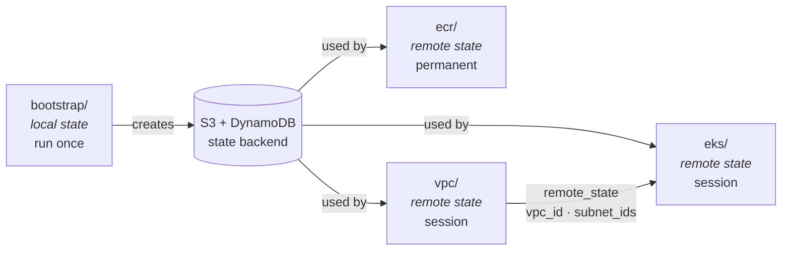
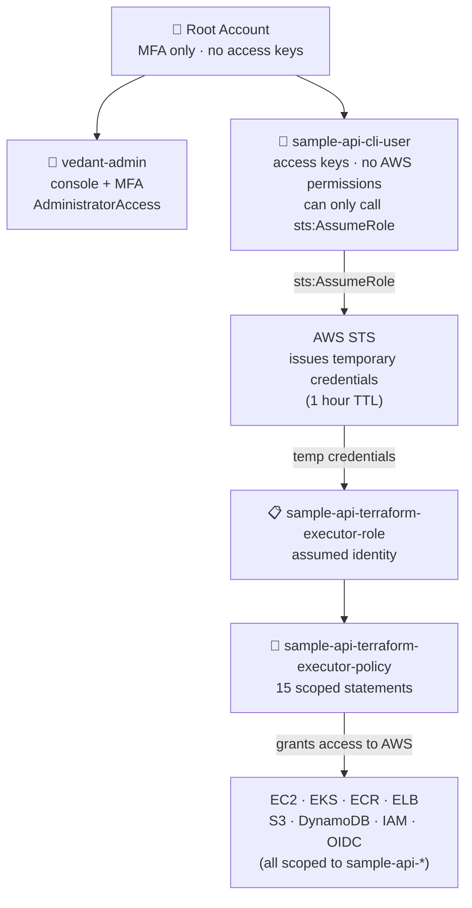
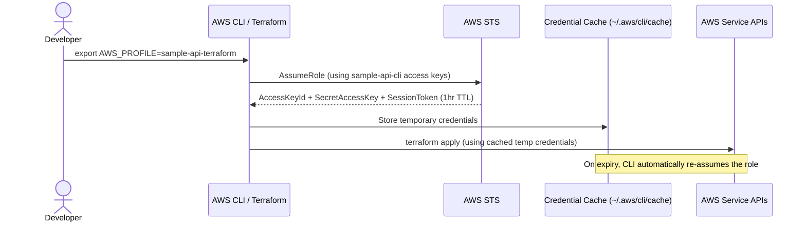

# Tooling & IAM

This page covers how the infrastructure is managed: the Terraform module structure, and the IAM hierarchy that allows a human operator to build and operate the system safely.

---

## Terraform

All infrastructure is defined in Terraform and applied manually. There is no automated Terraform execution — every `apply` is a deliberate human action. This is intentional: infrastructure changes should be reviewed before they happen, and the Git history of the deployment repo serves as the audit trail.

**Provider version:** `hashicorp/aws ~> 5.0`
**Terraform version:** `>= 1.0`

### Module Structure

The deployment repo (`sample-backend-api-app-dep`) contains four independent Terraform modules. Each module manages its own state in S3. They are applied in order because later modules depend on outputs from earlier ones.



```
sample-backend-api-app-dep/
├── bootstrap/        ← one-time only, local state
│   └── main.tf       creates S3 bucket + DynamoDB table
├── ecr/              ← permanent, remote state
│   └── main.tf       ECR repository + lifecycle policy
├── vpc/              ← session, remote state
│   └── main.tf       VPC, subnets, NAT, IGW, route tables
└── eks/              ← session, remote state
    ├── main.tf       EKS cluster, Fargate profiles, addons, access entry
    └── alb_controller.tf   ALB controller IAM role + policy
```

### Remote State

Every module except `bootstrap` stores its state in S3 with DynamoDB locking. The `eks` module reads VPC outputs directly from the VPC remote state — no values are hardcoded or passed manually between modules.

```hcl
data "terraform_remote_state" "vpc" {
  backend = "s3"
  config = {
    bucket = "sample-api-tfstate-065571033838"
    key    = "vpc/terraform.tfstate"
    region = "us-east-1"
  }
}
```

This means subnet IDs are never hardcoded. When the VPC is destroyed and recreated, the EKS module always picks up the new IDs automatically on the next apply.

### State Key Layout

| Module | State Key |
|---|---|
| `bootstrap` | local only — `bootstrap/terraform.tfstate` |
| `ecr` | `ecr/terraform.tfstate` |
| `vpc` | `vpc/terraform.tfstate` |
| `eks` | `eks/terraform.tfstate` |

### AWS Profile in Use

All Terraform operations run under the `sample-api-terraform` profile, which assumes the `sample-api-terraform-executor-role` via STS:

```bash
export AWS_PROFILE=sample-api-terraform
terraform apply
```

---

## Operator IAM

The IAM hierarchy for the human operator is designed around a core principle: **the entity that holds credentials should have no permissions of its own**.



Permissions live in a role that is assumed temporarily. This means static access keys — if compromised — cannot do anything without an additional STS call.

### Account Structure

```
Root account
  └── vedant-admin (console user, AdministratorAccess, MFA required)
        └── sample-api-cli-user (programmatic only, no permissions)
              └── assumes → sample-api-terraform-executor-role
                              └── sample-api-terraform-executor-policy (custom)
```

### Root Account

MFA is enabled on the root account. No access keys were created. The root account is not used after initial setup — all ongoing operations use `vedant-admin` or `sample-api-cli-user`.

### vedant-admin

Console access only. No programmatic access keys. Used for console-level operations and emergency access. Has `AdministratorAccess` attached — this is intentional for an admin user that is MFA-protected and console-only.

### sample-api-cli-user

The programmatic identity. Has **one inline policy** and nothing else:

```json
{
  "Version": "2012-10-17",
  "Statement": [{
    "Sid": "AssumeOnlyTerraformExecutorRole",
    "Effect": "Allow",
    "Action": "sts:AssumeRole",
    "Resource": "arn:aws:iam::065571033838:role/sample-api-terraform-executor-role"
  }]
}
```

The access keys for this user are the only long-lived credentials that exist. If they were leaked, an attacker could only call `sts:AssumeRole` for one specific role — nothing else.

### sample-api-terraform-executor-role

The role that actually holds permissions. Assumed by `sample-api-cli-user` via STS. The trust policy restricts assumption to exactly one principal:

```json
{
  "Version": "2012-10-17",
  "Statement": [{
    "Effect": "Allow",
    "Principal": {
      "AWS": "arn:aws:iam::065571033838:user/sample-api-cli-user"
    },
    "Action": "sts:AssumeRole"
  }]
}
```

When assumed, AWS STS issues a temporary credential set (access key + secret + session token) valid for one hour. These are what Terraform actually uses. They expire automatically.

### Credential Flow



### Local AWS Profile Configuration

Two profiles are configured locally. The `sample-api-terraform` profile performs role assumption automatically:

```ini
# ~/.aws/config

[profile sample-api-cli]
region = us-east-1

[profile sample-api-terraform]
role_arn       = arn:aws:iam::065571033838:role/sample-api-terraform-executor-role
source_profile = sample-api-cli
region         = us-east-1
```

When `AWS_PROFILE=sample-api-terraform` is set, the AWS CLI and Terraform SDK automatically call `sts:AssumeRole` using the `sample-api-cli` credentials and cache the temporary session. No manual STS calls needed.

---

## Executor Policy — sample-api-terraform-executor-policy

This is a custom policy — no AWS managed policies are attached to the executor role. Every statement was written explicitly. This has two advantages: it is auditable (you can read exactly what is allowed), and it enforces scope (the `sample-api-*` naming convention is enforced at the policy level, not just by convention).

The full policy contains 15 statements:

### EC2andVPC

```json
{
  "Sid": "EC2andVPC",
  "Effect": "Allow",
  "Action": [
    "ec2:Allocate*", "ec2:Associate*", "ec2:Attach*", "ec2:Authorize*",
    "ec2:Create*", "ec2:Delete*", "ec2:Describe*", "ec2:Detach*",
    "ec2:Disassociate*", "ec2:Modify*", "ec2:Release*", "ec2:Revoke*"
  ],
  "Resource": "*"
}
```

EC2 and VPC resources (subnets, route tables, security groups, internet gateways, NAT gateways, elastic IPs) do not support meaningful resource-level restrictions in IAM — the resource ARN format does not allow scoping by tag or name at the policy level for most actions. Wildcard resource is the standard pattern for VPC Terraform modules.

### EKS

```json
{ "Sid": "EKS", "Effect": "Allow", "Action": "eks:*", "Resource": "*" }
```

Full EKS permissions are required to create clusters, manage Fargate profiles, install add-ons, and configure access entries. EKS resource ARNs can be scoped by cluster name in some actions, but the Terraform EKS module requires broad access during the creation phase before the cluster ARN is known.

### ECR

```json
{ "Sid": "ECR", "Effect": "Allow", "Action": "ecr:*", "Resource": "*" }
```

Required for creating and managing the ECR repository, setting lifecycle policies, and performing image pushes from the local machine.

### ELB

```json
{ "Sid": "ELB", "Effect": "Allow", "Action": "elasticloadbalancing:*", "Resource": "*" }
```

Required for Terraform to manage ELB resources created by the ALB controller. The ALB Controller itself uses IRSA for its own permissions — this statement covers Terraform's view of the same resources.

### KMS

```json
{ "Sid": "KMS", "Effect": "Allow", "Action": "kms:*", "Resource": "*" }
```

The EKS Terraform module creates a KMS key for secret encryption by default. This statement was added during the EKS apply phase after a `kms:TagResource` denial. KMS key ARNs are not known before creation, so resource scoping is not possible here.

### CloudWatchLogs

```json
{ "Sid": "CloudWatchLogs", "Effect": "Allow", "Action": "logs:*", "Resource": "*" }
```

Required for Terraform to create the `/aws/eks/sample-api-cluster/cluster` log group. Added after a `logs:CreateLogGroup` denial during EKS apply.

### S3TerraformStateBucket

```json
{
  "Sid": "S3TerraformStateBucket",
  "Effect": "Allow",
  "Action": ["s3:*Bucket*", "s3:ListBucket", "s3:GetEncryptionConfiguration", "s3:PutEncryptionConfiguration"],
  "Resource": "arn:aws:s3:::sample-api-tfstate-*"
}
```

Scoped to `sample-api-tfstate-*` buckets only. Covers bucket-level operations (versioning, encryption config, public access block). The executor role cannot access any other S3 bucket.

### S3TerraformStateObjects

```json
{
  "Sid": "S3TerraformStateObjects",
  "Effect": "Allow",
  "Action": ["s3:GetObject", "s3:PutObject", "s3:DeleteObject"],
  "Resource": "arn:aws:s3:::sample-api-tfstate-*/*"
}
```

Scoped to objects within `sample-api-tfstate-*` buckets. These three actions are the exact operations Terraform performs on state files — read, write, and delete (for state cleanup).

### DynamoDBTerraformLock

```json
{
  "Sid": "DynamoDBTerraformLock",
  "Effect": "Allow",
  "Action": ["dynamodb:CreateTable", "dynamodb:DeleteTable", "dynamodb:DescribeTable",
             "dynamodb:GetItem", "dynamodb:PutItem", "dynamodb:DeleteItem",
             "dynamodb:TagResource", "dynamodb:UntagResource", "dynamodb:ListTagsOfResource"],
  "Resource": "arn:aws:dynamodb:us-east-1:065571033838:table/sample-api-*"
}
```

Scoped to `sample-api-*` DynamoDB tables. `GetItem`, `PutItem`, and `DeleteItem` are the lock operations Terraform performs at the start and end of each `apply`. The executor role cannot touch any other DynamoDB table in the account.

### SecretsManager

```json
{
  "Sid": "SecretsManager",
  "Effect": "Allow",
  "Action": ["secretsmanager:CreateSecret", "secretsmanager:DeleteSecret",
             "secretsmanager:DescribeSecret", "secretsmanager:GetSecretValue",
             "secretsmanager:PutSecretValue", "secretsmanager:TagResource",
             "secretsmanager:UntagResource"],
  "Resource": "arn:aws:secretsmanager:us-east-1:065571033838:secret:sample-api-*"
}
```

Scoped to `sample-api-*` secrets. Included for future use — application secrets will move from hardcoded manifest values to Secrets Manager in a later phase.

### IAMRoles

```json
{
  "Sid": "IAMRoles",
  "Effect": "Allow",
  "Action": ["iam:CreateRole", "iam:DeleteRole", "iam:GetRole", "iam:AttachRolePolicy",
             "iam:DetachRolePolicy", "iam:PutRolePolicy", "iam:DeleteRolePolicy",
             "iam:GetRolePolicy", "iam:ListRolePolicies", "iam:ListAttachedRolePolicies",
             "iam:TagRole", "iam:UntagRole", "iam:UpdateAssumeRolePolicy",
             "iam:ListInstanceProfilesForRole"],
  "Resource": "arn:aws:iam::065571033838:role/sample-api-*"
}
```

Scoped to `sample-api-*` roles only. Terraform needs to create and manage IAM roles for Fargate profiles and the ALB controller (IRSA role). The executor role cannot create or modify roles with any other name prefix.

### IAMPolicies

```json
{
  "Sid": "IAMPolicies",
  "Effect": "Allow",
  "Action": ["iam:CreatePolicy", "iam:DeletePolicy", "iam:GetPolicy",
             "iam:GetPolicyVersion", "iam:ListPolicyVersions",
             "iam:CreatePolicyVersion", "iam:DeletePolicyVersion",
             "iam:TagPolicy", "iam:UntagPolicy"],
  "Resource": "arn:aws:iam::065571033838:policy/sample-api-*"
}
```

Scoped to `sample-api-*` policies only. Required for Terraform to create the ALB controller policy.

### IAMPassRole

```json
{
  "Sid": "IAMPassRole",
  "Effect": "Allow",
  "Action": "iam:PassRole",
  "Resource": "arn:aws:iam::065571033838:role/sample-api-*",
  "Condition": {
    "StringEquals": {
      "iam:PassedToService": ["eks.amazonaws.com", "ec2.amazonaws.com", "elasticloadbalancing.amazonaws.com"]
    }
  }
}
```

`iam:PassRole` allows an IAM principal to hand a role to an AWS service. Without a `Condition`, this could be used for privilege escalation — passing a powerful role to a service that then acts with those permissions. The `PassedToService` condition restricts which services the executor role can pass roles to: only EKS, EC2, and ELB. Even within those services, only `sample-api-*` roles can be passed.

### IAMServiceLinkedRoles

```json
{
  "Sid": "IAMServiceLinkedRoles",
  "Effect": "Allow",
  "Action": "iam:CreateServiceLinkedRole",
  "Resource": [
    "arn:aws:iam::065571033838:role/aws-service-role/eks.amazonaws.com/*",
    "arn:aws:iam::065571033838:role/aws-service-role/eks-fargate.amazonaws.com/*",
    "arn:aws:iam::065571033838:role/aws-service-role/elasticloadbalancing.amazonaws.com/*"
  ]
}
```

Service-linked roles are special IAM roles that AWS services create and manage on their behalf. EKS and Fargate need to create these during cluster provisioning. This statement grants creation rights for exactly three service-linked role paths — nothing else.

### OIDC

```json
{
  "Sid": "OIDC",
  "Effect": "Allow",
  "Action": ["iam:CreateOpenIDConnectProvider", "iam:DeleteOpenIDConnectProvider",
             "iam:GetOpenIDConnectProvider", "iam:TagOpenIDConnectProvider",
             "iam:UntagOpenIDConnectProvider"],
  "Resource": [
    "arn:aws:iam::065571033838:oidc-provider/token.actions.githubusercontent.com",
    "arn:aws:iam::065571033838:oidc-provider/oidc.eks.us-east-1.amazonaws.com/*"
  ]
}
```

Scoped to exactly two OIDC providers: the GitHub Actions OIDC provider (for future GitHub Actions OIDC integration) and the EKS cluster OIDC provider (for IRSA). The executor role cannot create OIDC providers for any other identity provider.

---

## Naming Convention

All IAM resources, Terraform state resources, and AWS resources follow the `sample-api-*` prefix. This is not just a convention — it is enforced by the executor policy itself. Any Terraform resource that does not follow the naming convention will be denied at the IAM level, not just rejected by code review.

| Resource type | Pattern |
|---|---|
| IAM roles | `sample-api-{component}-role` |
| IAM policies | `sample-api-{component}-policy` |
| S3 buckets | `sample-api-tfstate-{account_id}` |
| DynamoDB tables | `sample-api-*` |
| Secrets | `sample-api-*` |
| AWS resources (VPC, EKS, ECR) | `sample-api-{component}` |
